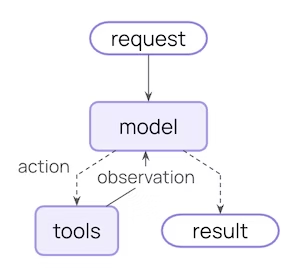
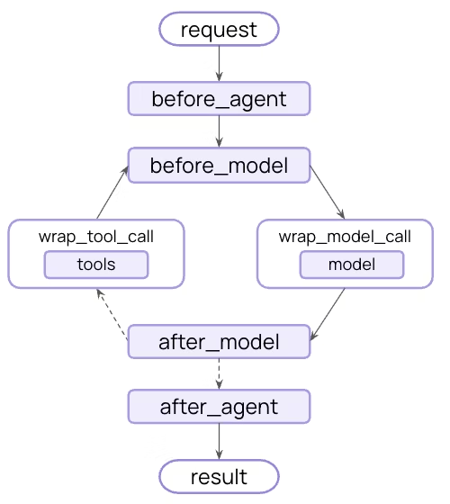

# 遵循ReAct模式开发的基础智能体对象

> 代码主要位于 [./packages/agent/src/index.ts](../packages/agent/src/index.ts)

ReAct（Reason + Action）是一种让大语言模型（LLM）具备“思考+行动”能力的智能体模式，它将推理链与外部工具调用结合，使模型不仅能生成答案，还能主动获取实时信息、执行任务并迭代优化结果。

## 核心流程

- 精心设计Prompt：明确任务目标、可用工具及调用规则。

- 推理（Reason）：LLM分析当前信息，判断缺失内容及下一步策略。

- 行动（Action）：调用指定外部工具（如API、计算器、搜索引擎）。

- 观察（Observation）：接收工具返回结果并更新上下文。

- 循环迭代：重复推理-行动-观察，直到信息充分。

- 最终答案（Final Answer）：输出完整结论，结束流程。

下面是简单的流程图：

## 中间件

在智能体的特殊阶段，插入生命周期钩子，例如可以实现对上下文管理，设计出记忆系统等：

